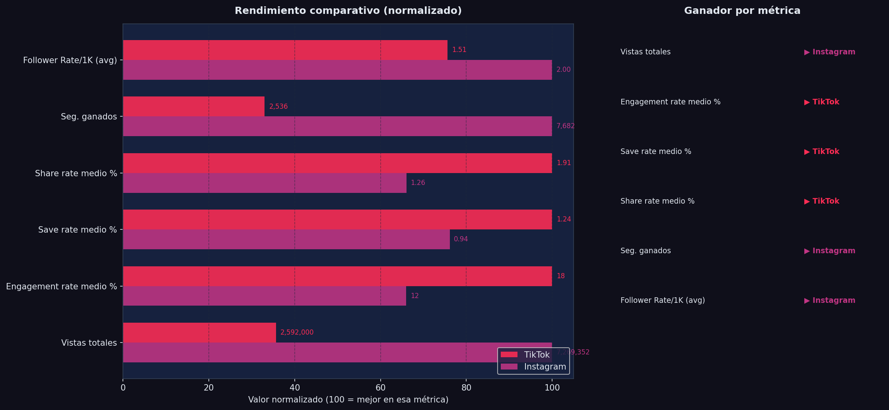
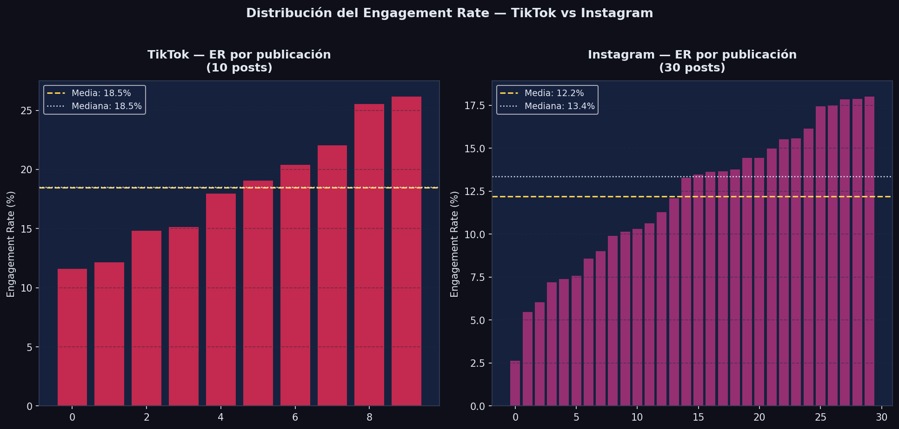
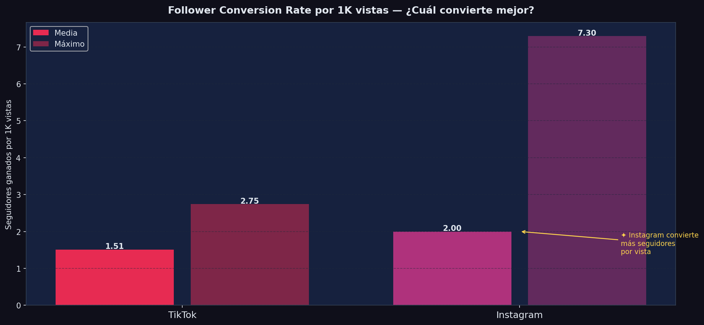
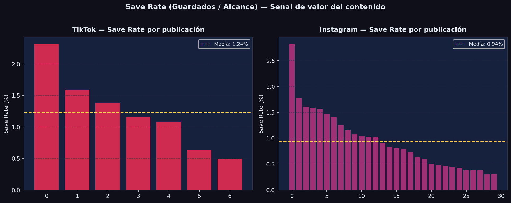
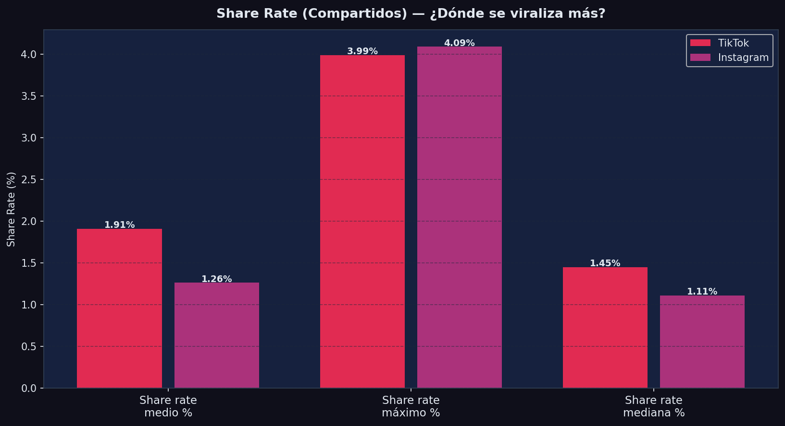
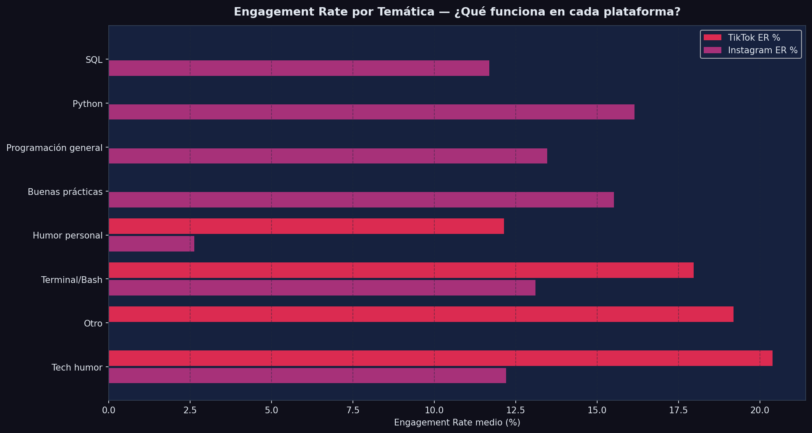
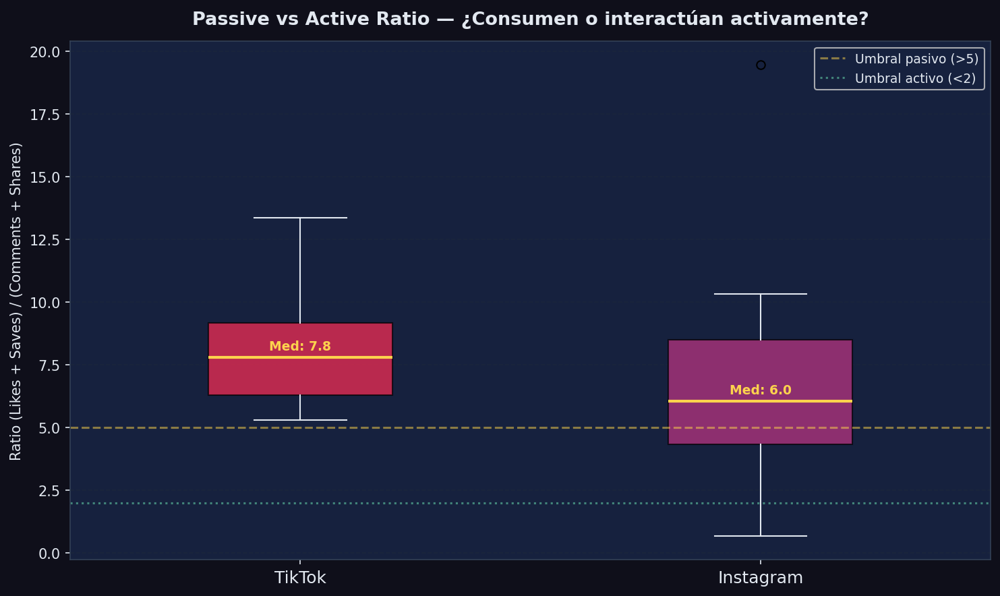
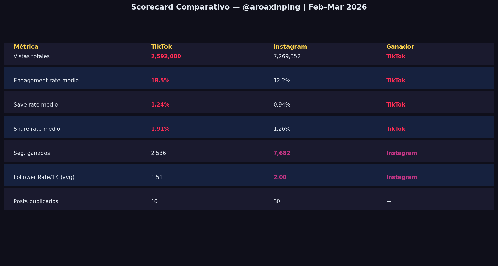

# 📊 Social Media Analytics — TikTok vs Instagram

> Análisis comparativo cross-platform @aroaxinping · Período: 24 Feb – 24 Mar 2026

---

## ¿De qué trata este proyecto?

Después de construir proyectos de analytics individuales para [TikTok](https://github.com/aroaxinping/tiktok-analytics-aroaxinping) e [Instagram](https://github.com/aroaxinping/instagram-analytics-aroaxinping), el siguiente paso natural fue compararlos directamente: ¿qué plataforma convierte mejor? ¿dónde tiene más impacto el contenido de datos/tech? ¿qué métricas clave difieren entre ambos algoritmos?

**Mismo período, mismo creador, dos algoritmos distintos.**

---

## Datos utilizados

| Plataforma | Fuente | Posts analizados | Período |
|---|---|---|---|
| TikTok | TikTok Studio (manual) | 10 vídeos | 24 Feb – 24 Mar 2026 |
| Instagram | Meta Business Suite (manual) | 30 reels | 24 Feb – 24 Mar 2026 |

---

## Resultados principales

### KPIs Comparativos



### Distribución del Engagement Rate



### Follower Conversion Rate / 1K Vistas



### Save Rate — Calidad del contenido



### Share Rate — Viralidad



### Rendimiento por Temática



### Passive vs Active Engagement



### Scorecard Ejecutivo



---

## Hallazgos clave

- **TikTok lidera en alcance absoluto**: 3.1M vistas en 10 vídeos vs ~200K en 30 reels en Instagram — el algoritmo de TikTok distribuye mucho más agresivamente contenido nuevo.
- **Instagram convierte mejor a seguidores**: mayor follower conversion rate relativo al alcance, lo que indica una audiencia más alineada con el perfil.
- **El contenido de humor personal bate a SQL/Python en ambas plataformas** en engagement rate puro — aunque el contenido técnico genera más guardados (calidad).
- **Save rate de Instagram es notablemente alto** (~5–8% medio), señal de que el contenido técnico se guarda para consultar después.
- **Passive vs Active ratio**: TikTok muestra ratios más extremos (vídeos virales con muchos likes pero poco comentario), Instagram es más consistente.

---

## Estructura del proyecto

```
social-media-analytics-aroaxinping/
├── data/
│   ├── tiktok/
│   │   ├── videos_engagement.csv
│   │   └── overview_metrics.csv
│   └── instagram/
│       ├── reels_metricas.csv
│       └── metricas_diarias.csv
├── src/
│   └── analyze.py          # Script principal de análisis comparativo
├── visuals/                # 8 gráficas generadas
├── notebooks/
│   └── cross_platform_analysis.ipynb
├── requirements.txt
└── README.md
```

---

## Cómo reproducir

```bash
git clone https://github.com/aroaxinping/social-media-analytics-aroaxinping
cd social-media-analytics-aroaxinping
pip install -r requirements.txt
python src/analyze.py
```

---

## Dashboards en Tableau Cloud

Los tres workbooks están publicados en Tableau Cloud y disponibles como `.twbx` en `tableau/`:

| Workbook | Contenido | Archivo |
|---|---|---|
| [TikTok Analytics — @aroaxinping](https://prod-ch-a.online.tableau.com/t/aroaxinping-a03b6e9139/views/TikTokAnalyticsaroaxinping) | Vistas, ER, completion rate y virality score por vídeo | `tableau/TikTok Analytics — @aroaxinping.twbx` |
| [Instagram Analytics — @aroaxinping](https://prod-ch-a.online.tableau.com/t/aroaxinping-a03b6e9139/views/InstagramAnalyticsaroaxinping) | Top Reels por visualizaciones, ER y Save Rate por contenido | `tableau/Instagram Analytics — @aroaxinping.twbx` |
| [Cross-platform Analytics — @aroaxinping](https://prod-ch-a.online.tableau.com/t/aroaxinping-a03b6e9139/views/Cross-platformAnalyticsaroaxinping) | Comparativa mensual de vistas y engagement rate entre TikTok e Instagram | `tableau/Cross-platform Analytics — @aroaxinping.twbx` |

---

## Proyectos individuales

- [instagram-analytics-aroaxinping](https://github.com/aroaxinping/instagram-analytics-aroaxinping) — análisis profundo de Instagram con métricas diarias, por reel y Excel avanzado
- [tiktok-analytics-aroaxinping](https://github.com/aroaxinping/tiktok-analytics-aroaxinping) — análisis de TikTok con 8 visualizaciones y Excel con fórmulas de social media

---

---

## Dashboard interactivo

`dashboard/crossplatform_dashboard.html` — 6 graficos comparativos: vistas medias, ER medio, distribucion de vistas (box plot), save rate vs share rate, seguidores por publicacion, ER vs vistas scatter.

Para verlo: descarga el archivo y abrelo en el navegador, o clona el repo y ejecuta `open dashboard/crossplatform_dashboard.html`.

Regenerar con datos nuevos:
```bash
python3 dashboard/build_dashboard.py
```

---

`Python` `pandas` `matplotlib` `plotly` `numpy` · *Periodo: 24 Feb – 24 Mar 2026*
